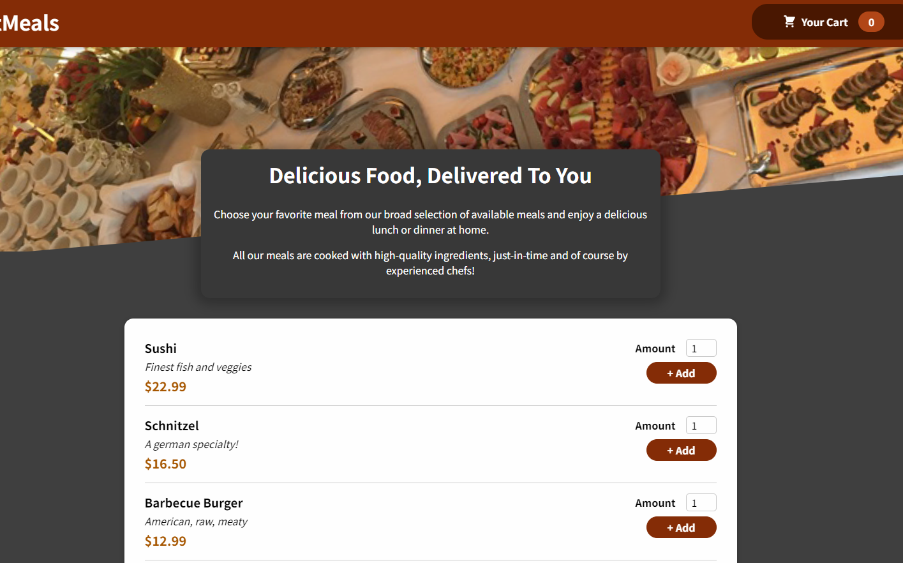
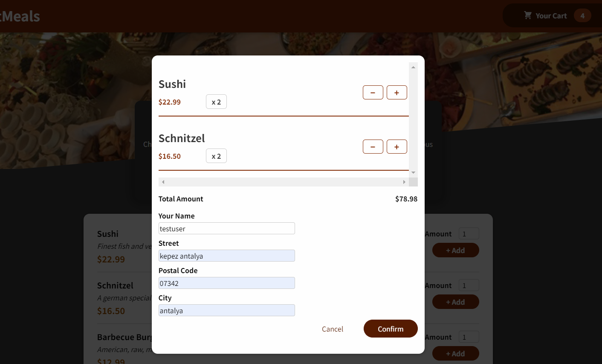
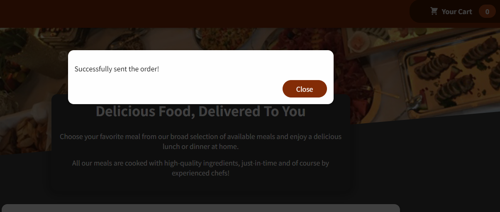

# React-Study Applications for My development

This repo includes my review and practise about rasct features learning by me.
It mostly shows and related to Maximiliann React courses and assignments. I will follow this procedure and i use same repo for my works.

There is more then one project for React-apps.

Which topics cover:
- React Hooks
- useContext, ReactContext
- Provider and Consumer
- Firebase Realtime Database
- Custom react hooks generations
- useEffect and useState properties differenxes and usage
- fetch data from API
- create custom fetch data hook

Main screen:

Layout Screen and Modals:

